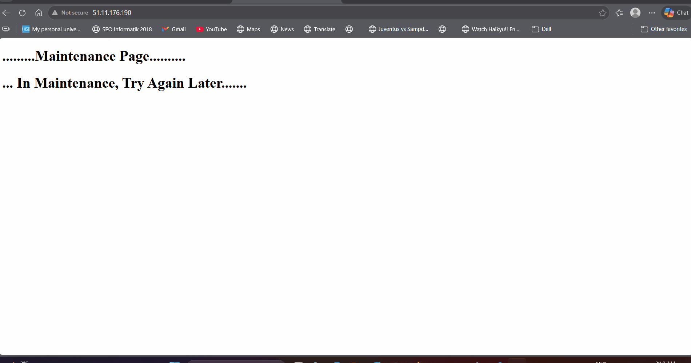
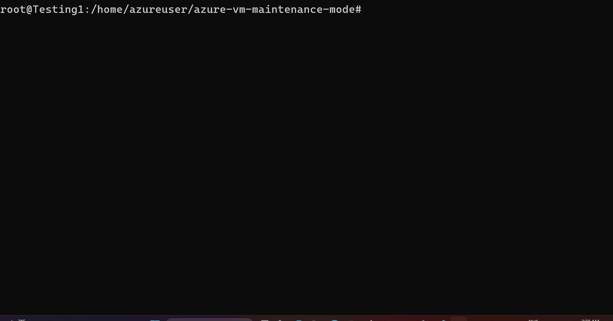

# Azure-vm-maintenance-mode

## Summary

This project demonstrates how systemd targets and services work together in Linux, combined with automation scripts, to simulate a real-world maintenance workflow.


The main objective of this project is to showcase:

* How systemd targets control system states
* How services are managed under different targets
* How Bash scripts can automate system-level operations
* How these concepts are applied in real-world server maintenance and DevOps workflows

To keep the implementation simple and focused, the project uses:

* Two static HTML pages:

  * `/live/index.html` to represent a live website
  * `/maintenance/maintenance.html` to represent a maintenance page
* Nginx configuration files to serve these pages
* A custom `maintenance.target` to demonstrate system state isolation
* A script (`appstart.sh`) to automate switching between modes

---

## How it Works

### Normal (Live Mode)
In normal mode, Nginx serves content from:

```
/live/index.html
```
### Maintenance Mode

In maintenance mode:

* Nginx switches to serve:

```
/maintenance/maintenance.html
```

* systemd isolates the system into:

```
maintenance.target
```

Only essential services remain active, such as:

* SSH
* Nginx
* Network

---

## Workflow

When the script is executed:

```
sudo ./appstart.sh
```



The following steps occur:

### 1. Systemd Target Setup

* The `maintenance.target` file is copied to:

```
/etc/systemd/system/
```

* systemd is reloaded so it recognizes the new target

---

### 2. Nginx Configuration Setup

* Nginx configuration files are copied to:

```
/etc/nginx/sites-available/
```

These configurations define:

* Live site directory (`/live/index.html`)
* Maintenance page directory (`/maintenance/maintenance.html`)

---

### 3. Symbolic Link Management

* Nginx uses:

```
/etc/nginx/sites-enabled/
```

* A symbolic link points to either:

  * the live configuration
  * or the maintenance configuration

The script dynamically updates this symlink depending on the selected mode.

---

### 4. Mode Switching

Based on user input:

* Selecting `1` switches to Maintenance Mode
* Selecting `2` switches back to Normal Mode

The script performs:

* Nginx configuration switch
* Nginx reload
* systemd target isolation

Commands used internally:

```
systemctl isolate maintenance.target
```

or

```
systemctl isolate multi-user.target
```

---

## Real-World Relevance

This project reflects real-world server maintenance practices where:

* Systems require controlled downtime
* User access must remain predictable and informative
* Backend services may be stopped or isolated
* Frontend services (like Nginx) remain active to serve a maintenance page

Instead of completely shutting down a server, production systems often:

* Keep web servers running
* Provide a maintenance message to users
* Maintain administrative access via SSH

This approach is commonly used in:

* Cloud platforms such as Azure and AWS
* DevOps workflows
* Production deployment pipelines
* Scheduled maintenance operations

---

## Project Structure

Based on the repository:

[https://github.com/zishankhan-dot/azure-vm-maintenance-mode](https://github.com/zishankhan-dot/azure-vm-maintenance-mode)

```
azure-vm-maintenance-mode/
├── appstart.sh
├── html/
│    └── config/
|           ├── live.conf
│           ├── maintenance.conf
|           ├── mvconf.sh
│   └── htmlServe/
│       ├── live/
│       │   └── index.html
│       └── maintenance/
│           └── maintenance.html
├── systemd/
│   └── maintenance.target
├── scripts/
│   └── maintenance_off.sh
│   └── maintenance_on.sh
├── docs/
│   └── Animation_1.gif
│   └── Animation_2.gif
│   └── Animation_3.gif
|   └── README.md
```


## Usage

Run the script with superuser privileges:

```
sudo ./appstart.sh
```

Menu options:

```
1 → Switch to Maintenance Mode  
2 → Switch to Normal Mode
3 → Show Status  
q → Exit  
```

---

## Important Notes

* The script must be executed with sudo privileges
* Ensure Nginx is installed and running
* Test `maintenance.target` carefully before full use
* Always keep at least one active SSH session during testing

---

## License
MIT License

---

## Author
Zishan Hassan Khan
Interested in DevOps, Cloud, AI and Software Development <br>
LinkedIn: [https://www.linkedin.com/in/zishan-hassan-khan-935568281/](https://www.linkedin.com/in/zishan-hassan-khan-935568281/)
---

## Note
This README file was created with the help of AI to ensure a clear and well-structured presentation.
